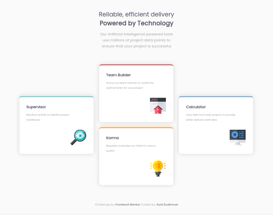

### Frontend Mentor - Four card feature section solution

This is a solution to the [Four card feature section challenge on Frontend Mentor](https://www.frontendmentor.io/challenges/four-card-feature-section-weK1eFYK). Frontend Mentor challenges help you improve your coding skills by building realistic projects. 

#### Table of contents

- [Overview](#overview)
  - [The challenge](#the-challenge)
  - [Built with](#built-with)
  - [Links](#links)
  - [Screenshot](#screenshot)

### Overview

#### The challenge

Users should be able to:

- View the optimal layout for the site depending on their device's screen size

#### Built with

- Semantic HTML5 markup
- CSS custom properties

#### Links

- Solution URL: [Click here to see the source](https://github.com/ayidsudirman/four-card-feature-section)
- Live Site URL: [Click here to see live demo](https://ayidsudirman.github.io/four-card-feature-section)

#### Screenshot

